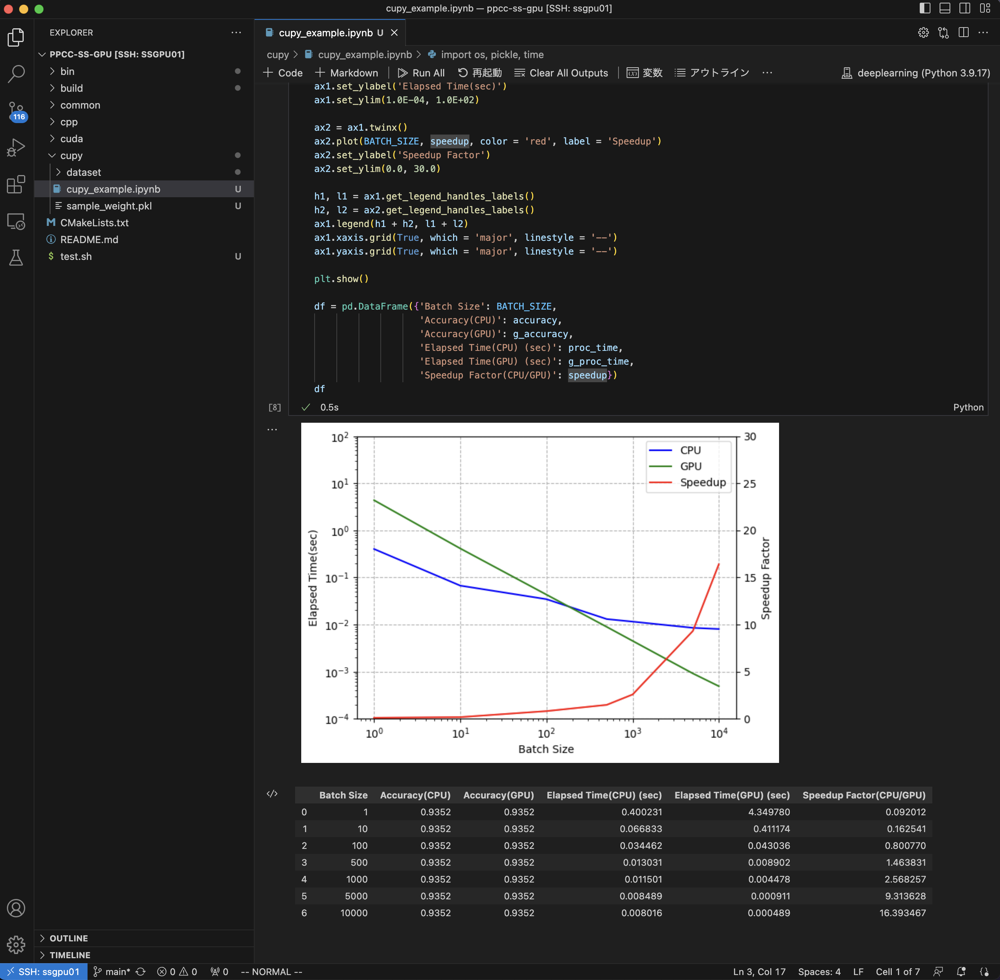
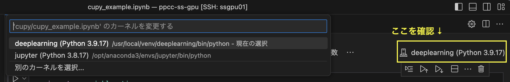
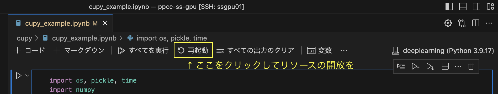

# PPCC-SS-GPU

[第6回粒子物理コンピューティングサマースクール](https://wiki.kek.jp/display/PPCC/PPCC-SS-2023)
での共通講習「GPUプログラミング」のサンプルコードです。
本コードは、サマースクールで用意したGPU環境で動かすことを想定しています。

## アプリの内容
- SAXPY
- 乱数を使った円周率の計算
- CuPyのサンプルコード(MNISTデータセットを使った推論)

## コードのビルド

### 前準備
2台あるGPU環境のいずれかにログインし、`.bashrc`に次の3行を加えてください。

```
export CUDA_PATH=/usr/local/cuda
export PATH=$CUDA_PATH/bin:$PATH 
export LD_LIBRARY_PATH=$CUDA_PATH/lib64:$LD_LIBRARY_PATH
```

変更を反映します。

```
. .bashrc
```

### コードの取得

```
$ git clone git@github.com:shogo0416/ppcc-ss-gpu
```

> **Note**
> GitHubのアカウントを持っていない場合はZIPファイルをダウンロードして、
> 計算環境にコピーして下さい。

### ビルドの実行
`build`ディレクトリを作り、そこでコードのビルドを実行するとします。

```
$ cd ppcc-ss-gpu
$ mkdir build && cd build
$ cmake3 ../
$ make install
```

> **Note**
> Cmakeのversionは`3.17`以上を想定しています。
> `cmake3`コマンドで`Makefile`を作成してください。

`make install`が済むと`bin`ディレクトリが作成され、
そこに実行ファイルがあります。

```
$ cd ../bin/
$ ls
cpp-pi  cpp-saxpy  cuda-pi  cuda-saxpy
```

|実行ファイル|説明|
|------------|----|
|cpp-saxpy|CPUで実行するSAXPYのプログラム|
|cpp-pi|CPUで実行する円周率の計算(マルチスレッド対応)|
|cuda-saxpy|GPUで実行するSAXPYのプログラム|
|cuda-pi|GPUで実行する円周率の計算|

> **Note**
> ご自身でGPU環境を持っていてそこで走らせる場合は、
> cmakeを実行する際に`-DPPCC_ENV=False`を入れて下さい。
> ```
> $ cmake3 -DPPCC_ENV=False ../
> ```

## アプリを実行する上での注意点

サマースクールの4台の計算環境のうち、2台にはそれぞれNVIDIA A100 GPUが1基ずつ搭載されています。
各環境において[MIGモード](https://blogs.nvidia.co.jp/2020/05/27/multi-instance-gpus/)により
1基のA100 GPUのリソースを分割して7基の「小さなGPU」(以下、インスタンスと呼ぶ)が
起動しています。GPUで何らかの計算を実行するときには、空いているインスタンスを利用するようにしてください。
以下、インスタンスを指定してCUDAプログラムを実行する方法を示します。

### インスタンスの空き状況の確認

`nvidia-smi`コマンドを実行すると`MIG devices`テーブルが表示されて、7つのインスタンスが
起動していることが分かります。それぞれのインスタンスは`GI ID`や`MIG Dev`
で識別されます。下の例では、各インスタンスには`GI ID`が7から13、`MIG Dev`は0から6が
割り振られていることが確認できます。

```
$ nvidia-smi
Fri Jul 28 21:48:46 2023       
+---------------------------------------------------------------------------------------+
| NVIDIA-SMI 530.30.02              Driver Version: 530.30.02    CUDA Version: 12.1     |
|-----------------------------------------+----------------------+----------------------+
(中略)
+---------------------------------------------------------------------------------------+
| MIG devices:                                                                          |
+------------------+--------------------------------+-----------+-----------------------+
| GPU  GI  CI  MIG |                   Memory-Usage |        Vol|      Shared           |
|      ID  ID  Dev |                     BAR1-Usage | SM     Unc| CE ENC DEC OFA JPG|
|                  |                                |        ECC|                       |
|==================+================================+===========+=======================|
|  0    7   0   0  |              12MiB /  4864MiB  | 14      0 |  1   0    0    0    0 |
|                  |               0MiB /  8191MiB  |           |                       |
+------------------+--------------------------------+-----------+-----------------------+
|  0    8   0   1  |              12MiB /  4864MiB  | 14      0 |  1   0    0    0    0 |
|                  |               0MiB /  8191MiB  |           |                       |
+------------------+--------------------------------+-----------+-----------------------+
|  0    9   0   2  |             866MiB /  4864MiB  | 14      0 |  1   0    0    0    0 |
|                  |               2MiB /  8191MiB  |           |                       |
+------------------+--------------------------------+-----------+-----------------------+
|  0   10   0   3  |              12MiB /  4864MiB  | 14      0 |  1   0    0    0    0 |
|                  |               0MiB /  8191MiB  |           |                       |
+------------------+--------------------------------+-----------+-----------------------+
|  0   11   0   4  |              12MiB /  4864MiB  | 14      0 |  1   0    0    0    0 |
|                  |               0MiB /  8191MiB  |           |                       |
+------------------+--------------------------------+-----------+-----------------------+
|  0   12   0   5  |             354MiB /  4864MiB  | 14      0 |  1   0    0    0    0 |
|                  |               2MiB /  8191MiB  |           |                       |
+------------------+--------------------------------+-----------+-----------------------+
|  0   13   0   6  |              12MiB /  4864MiB  | 14      0 |  1   0    0    0    0 |
|                  |               0MiB /  8191MiB  |           |                       |
+------------------+--------------------------------+-----------+-----------------------+
(以下省略)
```

`nvidia-smi`を実行したときに一番下に表示される`Processes`というテーブルには使用中の
インスタンスが表示されます。下の例では、`GI ID`が9と12 (それぞれの`MIG Dev`は2と5) の
インスタンスが使用中です。これら以外のインスタンスを使ってCUDAプログラムを走らせます。
例として`GI ID`が7 (`MIG Dev`が0)のインスタンスを使うことにします。
このとき、インスタンスの指定で使う識別子は`UUID`になります。

```
$ nvidia-smi
Fri Jul 28 21:48:46 2023       
+---------------------------------------------------------------------------------------+
| NVIDIA-SMI 530.30.02              Driver Version: 530.30.02    CUDA Version: 12.1     |
|-----------------------------------------+----------------------+----------------------+
(中略)
+---------------------------------------------------------------------------------------+
| Processes:                                                                            |
|  GPU   GI   CI        PID   Type   Process name                            GPU Memory |
|        ID   ID                                                             Usage      |
|=======================================================================================|
|    0    9    0      11117      C   .../local/venv/deeplearning/bin/python      846MiB |
|    0   12    0      19476      C   .../local/venv/deeplearning/bin/python      334MiB |
+---------------------------------------------------------------------------------------+
```

### 各インスタンスのUUIDを取得
`nvidia-smi -L`でインスタンスのUUIDが表示されます。
ここで表示されている`Device`の0-6の数字は、`nvidia-smi`を実行した時の`MIG devices`テーブルに
表示される`MIG Dev`の0-6と一致します。GI IDが7(MIG Devが0)のインスタンスのUUIDは
MIG-554c4086-6ae7-5b25-8c39-e5980d23ae92です。

```
$ nvidia-smi -L
GPU 0: NVIDIA A100-SXM4-40GB (UUID: GPU-07ce7acc-c626-f86c-3b8c-170a84e404b3)
  MIG 1g.5gb      Device  0: (UUID: MIG-554c4086-6ae7-5b25-8c39-e5980d23ae92) <== このインスタンスを使う
  MIG 1g.5gb      Device  1: (UUID: MIG-9b9d3d09-b7d8-5351-af1e-5607f0fbd02a)
  MIG 1g.5gb      Device  2: (UUID: MIG-0dfbf33f-6966-5b43-a167-2cb7be339805)
  MIG 1g.5gb      Device  3: (UUID: MIG-1baae807-2fcd-5438-8a89-d320680ade08)
  MIG 1g.5gb      Device  4: (UUID: MIG-cedbde95-8c79-51e0-b848-7bf73342a233)
  MIG 1g.5gb      Device  5: (UUID: MIG-84f9461f-49b6-5343-a3b9-5be94986cdad)
  MIG 1g.5gb      Device  6: (UUID: MIG-95045bde-aa51-5831-8983-63dbf0262e77)
```

### インスタンスを指定してCUDAプログラムを実行
下記のように`CUDA_VISIBLE_DEVICES`という環境変数に先ほどのUUIDを指定し、
続けて実行ファイル名とそのオプションを与えてプログラムを実行します。

```
$ CUDA_VISIBLE_DEVICES=MIG-554c4086-6ae7-5b25-8c39-e5980d23ae92 ./bin/cuda-pi -n 10000000000000
```

`nvidia-smi`で`Processes`テーブルを確認すると、
指定したGI IDが7のインスタンスでプログラムが走っていることが確認できます。

```
$ nvidia-smi
... (途中省略)
+---------------------------------------------------------------------------------------+
| Processes:                                                                            |
|  GPU   GI   CI        PID   Type   Process name                            GPU Memory |
|        ID   ID                                                             Usage      |
|=======================================================================================|
|    0    7    0      30986      C   ./bin/cuda-pi                               104MiB | <== 指定したインスタンスで走っている
|    0    9    0      11117      C   .../local/venv/deeplearning/bin/python      846MiB |
|    0   12    0      19476      C   .../local/venv/deeplearning/bin/python      334MiB |
+---------------------------------------------------------------------------------------+
```

### 各アプリの実行時のオプションについて
アプリの実行時のオプションは `-h` で表示されます。

```
./bin/cuda-pi -h
```

## CuPyのサンプルコードについて

`cupy`ディレクトリには、MNISTデータセットを使った推論を題材としたCuPyのサンプルコードがあります。

### VSCode上で走らせる

例えば、VSCodeの`Remote SSH`拡張機能でGPU環境にSSH接続し、`Jupyter`拡張機能を使うことで
VSCode上でNotebookファイル`cupy_example.ipynb`を走らせることが可能です。



その際、Notebookを開いて`カーネルの選択`においてCuPyがインストールされたPython環境を指定する必要があります。
サマースクールのGPU環境では`deeplearning (Python 3.9.17)`がそれに該当しますので、それを選択していることを
確認してください。



MIG環境においてCuPyを走らせると自動的に空いているインスタンスに割り当てて計算を実行します。
計算が終わって結果を保存したあとは、VSCodeの上部メニューにある`再起動`をクリックすることで
使用中のGPUリソースの開放を必ず行ってください。



### 参考文献
ゼロから作るDeep Learning  
Python で学ぶディープラーニングの理論と実装  
斎藤 康毅 著  
ISBN: 978-4-87311-758-4  
第3.6節 手書き数字認識
